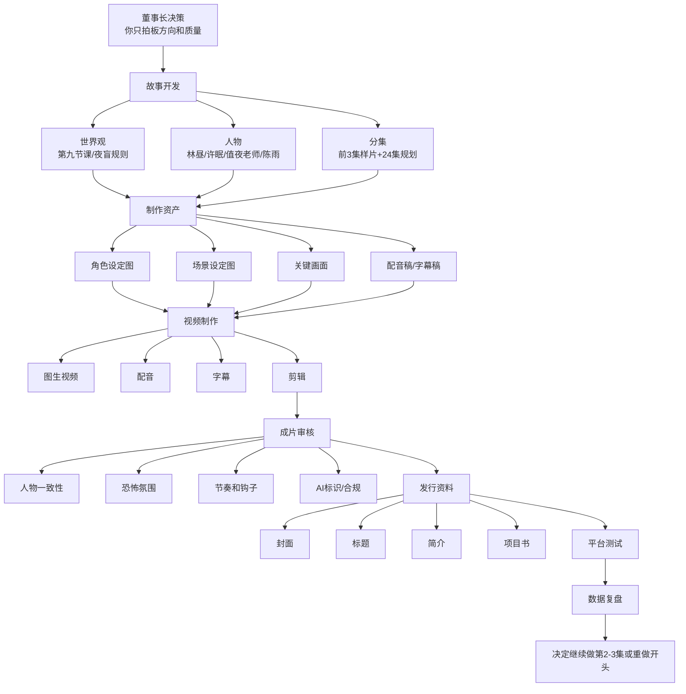
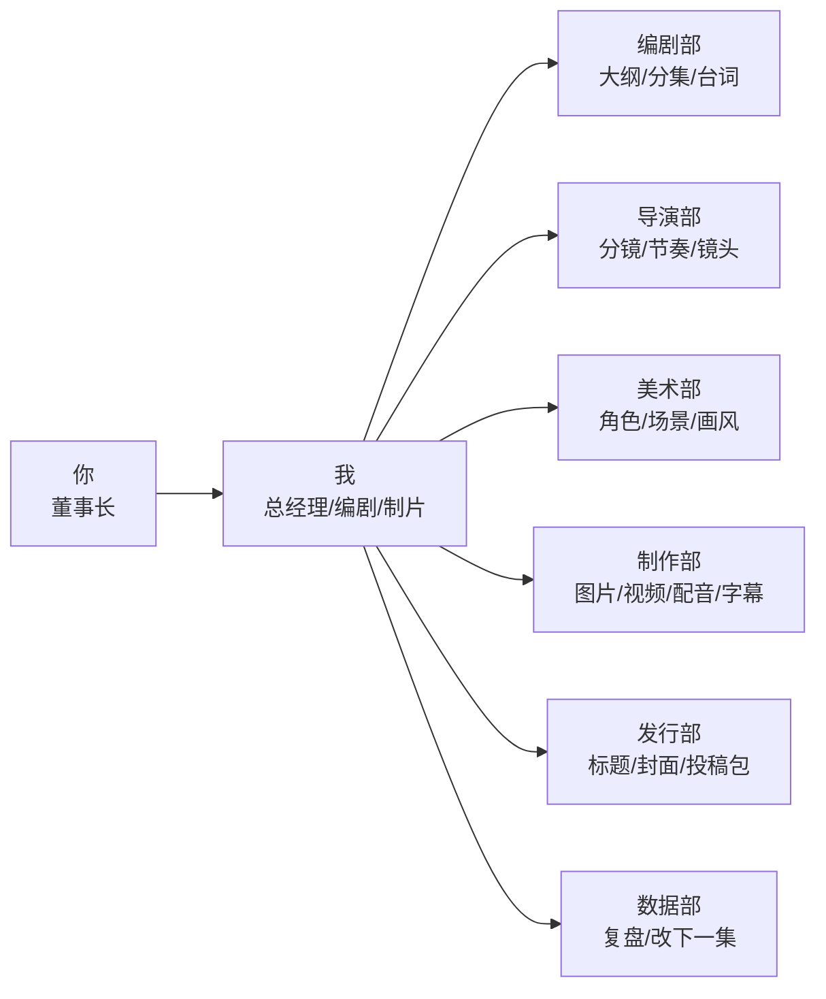

# 项目架构图

## 一张图看懂要做什么

```mermaid
flowchart TD
    A["董事长决策<br/>你只拍板方向和质量"] --> B["故事开发"]
    B --> B1["世界观<br/>第九节课/夜盲规则"]
    B --> B2["人物<br/>林昼/许眠/值夜老师/陈雨"]
    B --> B3["分集<br/>前3集样片+24集规划"]

    B1 --> C["制作资产"]
    B2 --> C
    B3 --> C

    C --> C1["角色设定图"]
    C --> C2["场景设定图"]
    C --> C3["关键画面"]
    C --> C4["配音稿/字幕稿"]

    C1 --> D["视频制作"]
    C2 --> D
    C3 --> D
    C4 --> D

    D --> D1["图生视频"]
    D --> D2["配音"]
    D --> D3["字幕"]
    D --> D4["剪辑"]

    D4 --> E["成片审核"]
    E --> E1["人物一致性"]
    E --> E2["恐怖氛围"]
    E --> E3["节奏和钩子"]
    E --> E4["AI标识/合规"]

    E --> F["发行资料"]
    F --> F1["封面"]
    F --> F2["标题"]
    F --> F3["简介"]
    F --> F4["项目书"]

    F --> G["平台测试"]
    G --> H["数据复盘"]
    H --> I["决定继续做第2-3集或重做开头"]
```

## 企业化分工

```mermaid
flowchart LR
    CEO["你<br/>董事长"] --> GM["我<br/>总经理/编剧/制片"]
    GM --> S1["编剧部<br/>大纲/分集/台词"]
    GM --> S2["导演部<br/>分镜/节奏/镜头"]
    GM --> S3["美术部<br/>角色/场景/画风"]
    GM --> S4["制作部<br/>图片/视频/配音/字幕"]
    GM --> S5["发行部<br/>标题/封面/投稿包"]
    GM --> S6["数据部<br/>复盘/改下一集"]
```

## 决策顺序

1. **先确认钩子强不强**：夜盲谎言 + 第九节课 + 被试探。
2. **再确认能不能低成本做**：校园场景少，人物少，可以做。
3. **再做第1集样片**：不要先做20集。
4. **样片通过后扩前3集**：验证节奏和画风。
5. **最后准备投稿包**：剧本、样片、封面、简介、AI标识。

